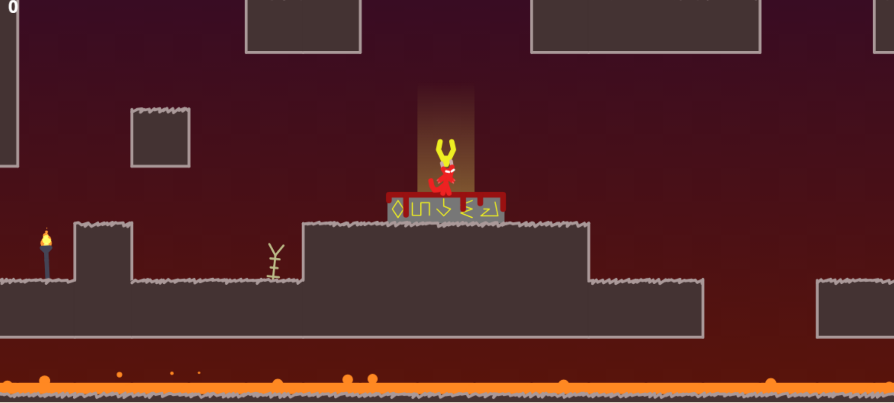

# 🌟 Rubaka 🌟

**Diciptakan dengan cinta oleh [Lamberth Rumpaidus](https://github.com/lamberthrumpaidus)**

  
  
<i>TAMPILAN AWAL</i>

**Rubaka** adalah **game aksi-platformer** yang membawa pemain ke dalam dunia mitologis yang misterius dan penuh tantangan. Kumpulkan tulang, hadapi musuh beragam, dan jelajahi biome yang unik untuk mencapai skor tertinggi dan mengukir namamu di puncak!

## 🎮 Fitur Utama
- **🔮 Pengumpulan Tulang**: Kumpulkan tulang untuk meningkatkan kesehatan dan kekuatan tempurmu.
- **❤️ Sistem Kesehatan**: Strategi penyembuhan yang membuat setiap keputusan menjadi penting.
- **🐉 Beragam Musuh**: Tantang dirimu melawan musuh dengan kemampuan unik dan taktik yang berbeda.
- **🌍 Biomes Berbeda**: Eksplorasi berbagai lingkungan menantang, masing-masing dengan tema dan rintangan tersendiri.

## 🌈 Biome
- **The Styx**: Dunia berwarna abu-abu yang penuh dengan skeleton dan lava berapi.
- **Asphodel Meadows**: Tanah berumput dengan gerbang dan saklar yang menantang.
- **Elysian Boneyard**: Area bertema tulang dihuni laba-laba dan perangkap bergerak.
- **Fields of Mourning**: Rintangan proyektil dan platforming lompatan udara yang menantang.
- **Throne Room**: Tempat puncak petualanganmu!

## 🚀 Bergabunglah dalam Petualangan
Apakah kamu siap menghadapi tantangan? **Bermain sekarang di [Rubaka](https://rubaka.netlify.app/)** dan buktikan kemampuanmu! 

Untuk informasi lebih lanjut dan perkembangan terbaru, kunjungi [profil saya](https://github.com/lamberthrumpaidus).

---

## 📝 Patch Notes / Update Log

### Update v1.1.0 - 19 April 2026
- **📱 UI & Controls (Mobile)**:
  - Perombakan total tata letak kontrol HP 
  - Menambahkan D-Pad (Atas, Bawah, Kiri, Kanan) untuk memanjat dinding dan navigasi.
  - Menambahkan tombol *skill* terpisah (Jump, Dash, Fire, Attack) yang dilengkapi label teks agar lebih mudah dimainkan.
  - Mekanik *Unlock*: Tombol kemampuan khusus (seperti Dash dan Fire) disembunyikan dan baru muncul setelah pemain mendapatkan *skill* tersebut di dalam game.
  - Menambahkan tombol **PAUSE** dan **MAP** di sudut atas layar yang selalu dapat diakses.
- **⚡ Performa & Optimalisasi**:
  - Memperbaiki *bug* *lag/slowdown* parah saat karakter mati dengan mengoptimalkan rendering partikel (beralih dari `shadowBlur` ke sistem *caching* gambar yang jauh lebih ringan).
  - Layar *Loading* dioptimalkan agar tidak *hang* di 99%.
- **✨ Grafik & Visual**:
  - Kualitas grafis ditingkatkan (tidak lagi dibatasi oleh ukuran file 13KB).
  - Menambahkan efek *Screen Shake* (getaran layar) saat menyerang atau terkena serangan untuk membuat pertarungan terasa lebih "berbobot".
  - Menambahkan efek partikel *glowing* (*additive blending*) pada efek api dan percikan.
- **⌨️ Kontrol (PC)**:
  - Menambahkan tombol `Enter` dan `Klik Kiri` (Mouse) sebagai opsi alternatif untuk menyerang.
